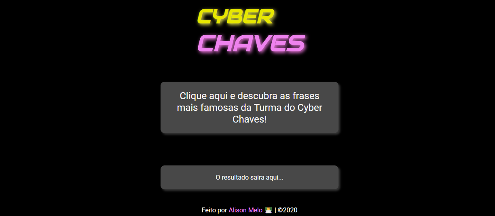

# Gerador-de-mensagens
Um gerador simples de mensagem utilizando JavaScript e Arrays.



## Visualizar

Você pode acessar o site clicando aqui: [github.io/Gerador-de-mensagens]( https://alisonmelo.github.io/Gerador-de-mensagens/)

## Tecnologias:

```
. HTML
. CSS
. JavaScript
```

## Autor
Alison Melo, para uma atividade do curso da Start Latam.
